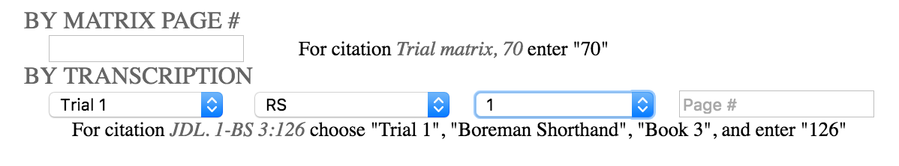
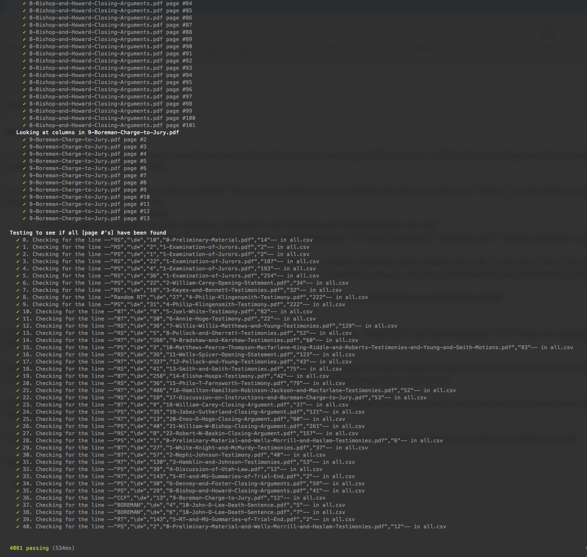

# Mountain Meadows Massacre
Data Extraction

## Purpose

  - Analyze a batch PDF documents
  - Generate an index that matches PDF page numbers, column, to [page numbers] indicated in the text
  - Create a UI to utilize the index/matrix 

TLDR: Deliverable: the `converterClient/js/index.js` file to be uploaded to `https://stage.mountainmeadowsmassacre.com/wp-content/transcripts/map/transcriptMap2.js`.

## Process

  - Extract table data using [tabula](lib/extract.sh)
  - Test extraction and correct using `npm test` with [book-info.js]( to [page numbers])
  - Search data, organizing results with [index.js](index.js)
  - Test search with `npm test`
  - Convert CSV into JSON, using [converterClient/index.html](converterClient/index.html), which I also built
  - In the [converterClient/js/index.js](converterClient/js/index.js), replace the variable `transcriptMap` with the JSON produced in the converter above
  - Upload [converterClient/js/index.js](converterClient/js/index.js) using the wordpress file uploader plugin, to the destination path `https://stage.mountainmeadowsmassacre.com/wp-content/transcripts/map/transcriptMap2.js` 

The goal is to use these tools for use of a small web component which will be live and available (soon) at [https://mountainmeadowsmassacre.com/legal](https://mountainmeadowsmassacre.com/legal).

## Screenshots

